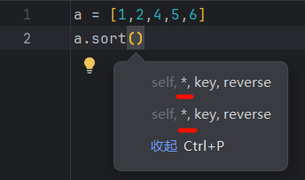
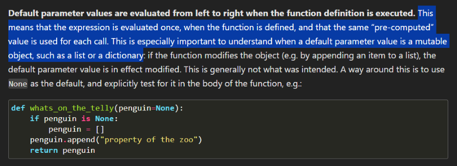
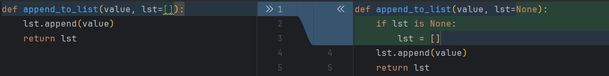
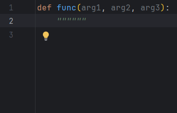
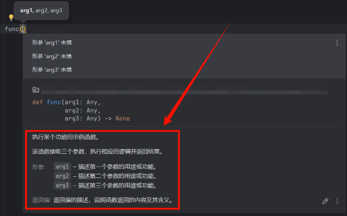

## 五、补充内容

### 👋 说明

有一部分内容虽然和这次的知识点相关，但因为这些内容比较复杂，解释起来需要较长篇幅。如果放在正文里，可能会占用过多的阅读精力和时间，因此我们选择将它们放在了补充内容部分，方便有兴趣或需要深入了解的同学参考。

> [!NOTE]  
> 这部分内容仅作为补充知识，大部分知识点在实际开发中很少遇到，甚至可能完全遇不到。如果实在不理解可以跳过。
>
> 内容较为零碎，但会尽量讲清楚，并在相关内容的前面提供参考资料和需要进一步了解的概念或术语。请耐心阅读，遇到不理解的地方可以上网查询，或者参考官方文档。

Python 官方文档链接：

- 简体中文：https://docs.python.org/zh-cn/3/index.html
- 繁体中文：https://docs.python.org/zh-tw/3/index.html
- 英文原文：https://docs.python.org/3/index.html

> [!NOTE]  
> Python 官方文档的简体中文版由 `Python document translators of Chinese (China) team`
> 志愿者共同维护，尽管团队努力确保翻译质量，文档中仍可能存在一些疏漏。如果你发现简体中文版本的表述不清晰或有问题，建议切换到繁体中文版本，或直接参考英文原文。
>
> 如果你有兴趣为 Python 官方文档的中文翻译做贡献，欢迎加入 `Python document translators` 翻译团队。你可以通过以下链接了解更多：
> - 简体中文翻译项目：https://github.com/python/python-docs-zh-cn
> - 繁体中文翻译项目：https://github.com/python/python-docs-zh-tw


~~PS: 官方文档真的除了 CPython 源代码什么都有，多看看没坏处。官方文档多好😄~~

~~PS: CPython源代码: https://github.com/python/cpython 🤓~~

---

在使用 `PyCharm` 编程时，你可能注意到它会自动提示函数的参数名，比如：



你可以通过官方文档中的 [.sort()](https://docs.python.org/zh-cn/3/library/stdtypes.html#list.sort) 来了解 `key` 和
`reverse` 参数的含义。但在它们之前还有两个参数：`self` 和 `*`。

- `self` 与 Python 类方法有关，它是类实例的引用。虽然这部分内容属于后续学习范围，但你可以提前了解更多关于 `self`
  的信息，[点击这里](https://docs.python.org/zh-cn/3/faq/programming.html#what-is-self)。

- `*` 则是我们要重点讨论的内容。它并不是一个普通参数，而是一个特殊符号，用于标识接下来的参数只能通过**关键字**
  传递，而不能作为位置参数。这是 Python 提供的一种方式，确保函数调用时参数的明确性和灵活性。

#### 1.2. 下面是官方文档中给出的解释

> [!NOTE]  
> 这里给出官方文档的链接：https://docs.python.org/zh-cn/3/tutorial/controlflow.html#special-parameters

默认情况下，参数可以按位置或显式关键字传递给 Python
函数。为了让代码易读、高效，最好限制参数的传递方式，这样，开发者只需查看函数定义，即可确定参数项是仅按位置、按位置或关键字，还是仅按关键字传递。

函数定义如下：

```
def f(pos1, pos2, /, pos_or_kwd, *, kwd1, kwd2):
      -----------    ----------     ----------
        |             |                  |
        |              --位置或关键字      |
        |                                -- 仅限关键字
         -- 仅限位置
```

`/` 和 `*` 是可选的。这些符号表明形参如何把参数值传递给函数：位置、位置或关键字、关键字。关键字形参也叫作命名形参。

##### 1.2.1. 位置或关键字参数

函数定义中未使用 `/` 和 `*` 时，参数可以按位置或关键字传递给函数。

##### 1.2.2. 仅位置参数

此处再介绍一些细节，特定形参可以标记为 *仅限位置*。*仅限位置* 时，形参的顺序很重要，且这些形参不能用关键字传递。仅限位置形参应放在
`/` （正斜杠）前。`/` 用于在逻辑上分割仅限位置形参与其它形参。如果函数定义中没有 `/`，则表示没有仅限位置形参。

`/` 后可以是 *位置或关键字* 或 *仅限关键字* 形参。

##### 1.2.3. 仅限关键字参数

把形参标记为 *仅限关键字*，表明必须以关键字参数形式传递该形参，应在参数列表中第一个 *仅限关键字* 形参前添加 `*`。

##### 1.2.4. 函数示例

请看下面的函数定义示例，注意 `/` 和 `*` 标记：

```python
def standard_arg(arg):
    print(arg)


def pos_only_arg(arg, /):
    print(arg)


def kwd_only_arg(*, arg):
    print(arg)


def combined_example(pos_only, /, standard, *, kwd_only):
    print(pos_only, standard, kwd_only)
```

第一个函数定义 `standard_arg` 是最常见的形式，对调用方式没有任何限制，可以按位置也可以按关键字传递参数：

```python
print(standard_arg(2))  # 输出：2

print(standard_arg(arg=2))  # 输出：2
```

第二个函数 `pos_only_arg` 的函数定义中有 `/`，仅限使用位置形参：

```python
print(pos_only_arg(1))  # 输出：1

pos_only_arg(arg=1)
# TypeError: pos_only_arg() got some positional-only arguments passed as keyword arguments: 'arg'
```

第三个函数 `kwd_only_args` 的函数定义通过 `*` 表明仅限关键字参数：

```python
kwd_only_arg(3)
# TypeError: kwd_only_arg() takes 0 positional arguments but 1 was given

print(kwd_only_arg(arg=3))  # 输出：3
```

最后一个函数在同一个函数定义中，使用了全部三种调用惯例：

```python
combined_example(1, 2, 3)
# TypeError: combined_example() takes 2 positional arguments but 3 were given

print(combined_example(1, 2, kwd_only=3))  # 输出：1 2 3

print(combined_example(1, standard=2, kwd_only=3))  # 输出：1 2 3

combined_example(pos_only=1, standard=2, kwd_only=3)
# TypeError: combined_example() got some positional-only arguments passed as keyword arguments: 'pos_only'
```

下面的函数定义中，`kwds` 把 `name` 当作键，因此，可能与位置参数 `name` 产生潜在冲突：

```python
def foo(name, **kwds):
    return 'name' in kwds
```

调用该函数不可能返回 `True`，因为关键字 `'name'` 总与第一个形参绑定。例如：

```python
foo(1, **{'name': 2})
# TypeError: foo() got multiple values for argument 'name'
```

加上 `/` （仅限位置参数）后，就可以了。此时，函数定义把 `name` 当作位置参数，`'name'` 也可以作为关键字参数的键：

```python
def foo(name, /, **kwds):
    return 'name' in kwds


print(foo(1, **{'name': 2}))  # 输出：True
```

换句话说，仅限位置形参的名称可以在 `**kwds` 中使用，而不产生歧义。

---

### 2. 默认参数的坑

#### 2.1. 引入

请你看一下下面的代码，猜测一下输出结果是什么：

```python
def append_to_list(value, lst=[]):
    lst.append(value)
    return lst


l1 = append_to_list(1)
l2 = append_to_list(2)
l3 = append_to_list(3, [1])
print(l1)
print(l2)
print(l3)
```

你可以在 [这里](../demo/supplement1_默认参数的坑1.py) 找到代码并尝试运行一下看看结果和预期的是否一样。

如果不一样，那么恭喜你掉到坑里了🤣。

#### 2.2. 原因

你可能对这个原因已经有了一些猜测，甚至已经猜到了：就是Python在做这种默认参数的时候，它只会把这个参数求一次值，然后把这个值作为默认参数。换句话说，
`l1`和`l2`用的`lst`是同一个`list`，而`list`在python是可变的，所以`l1`和`l2`共享了同一个`lst`对象。

那为了确认我们这个猜想呢，我们可以尝试在这里面打印一下它的id：

```python
print(id(lst))
```

> [!NOTE]  
> 你可以在 [这里](../demo/supplement1_默认参数的坑2.py) 找到完整的代码。

这是运行结果（每次运行的id结果不一定相同）：

```
lst id: 2282717434176
lst id: 2282717434176
lst id: 2282717436032
[1, 2]
[1, 2]
[1, 3]
```

可以看到这三个`id`相同，这说明`l1`和`l2`确实共享了同一个`lst`对象。而`l3`因为传进去了一个新的列表对象，所以跟其他两个不一样。

#### 2.3. 解决

实际上，python 是有一个官方的说明来解释这个事情的：



> [!NOTE]  
> 这是文档的链接：https://docs.python.org/3/reference/compound_stmts.html
>
> 文章较长，这段内容在文章的中间靠后的位置，可以直接在网页中搜索关键词`whats_on_`找到

解决办法很简单，就是使用`None`代替：

代码：

```python
def append_to_list(value, lst=None):
    if lst is None:
        lst = []
    lst.append(value)
    return lst
```

对比 *修改前（左），修改后（右）*：


> [!NOTE]  
> 你可以在 [这里](../demo/supplement1_默认参数的坑3.py) 找到完整的代码。

现在再次运行程序，结果就正常了：

```
[1]
[2]
[1, 3]
```

---

### 3. 关于文档字符串的补充

#### 3.1. 文档字符串的使用

在 PyCharm 中，输入函数定义后，直接输入三个引号并按回车键，可以自动生成一个文档字符串模板，非常方便：



示例代码：

```python
def func(arg1, arg2, arg3):
    """
    
    :param arg1:
    :param arg2:
    :param arg3:
    :return:
    """
```

这个自动生成的模板包括以下内容：

- **空行**：用于填写函数的简要功能描述。
- **`:param`**：用于描述每个参数的含义和用途。
- **`:return`**：用于描述函数的返回值。

Python 文档字符串官方的规范是 [PEP 257](https://www.python.org/dev/peps/pep-0257/)，它规定了如何编写清晰易懂的文档字符串。以下是一个符合规范的例子：

```python
def func(arg1, arg2, arg3):
    """
    执行某个功能的示例函数。

    该函数接收三个参数，执行相应的逻辑并返回结果。

    :param arg1: 描述第一个参数的用途或功能。
    :param arg2: 描述第二个参数的用途或功能。
    :param arg3: 描述第三个参数的用途或功能。
    :return: 返回值的描述，说明函数返回的内容及其含义。
    """
```

通过这个方法，PyCharm可以很方便的给你函数的提示：



#### 3.2. 文档字符串的样式

这里有一些文档字符串的样式可供你选择：

- `Epytext`
- `reStructuredText`（PyCharm默认样式）
- `NumPy`
- `Google`

以下是几种样式的对比：

```python
# Epytext
def func(arg1, arg2, arg3):
    """

    @param arg1:
    @param arg2:
    @param arg3:
    @return:
    """


# reStructuredText
def func(arg1, arg2, arg3):
    """

    :param arg1:
    :param arg2:
    :param arg3:
    :return:
    """


# NumPy
def func(arg1, arg2, arg3):
    """
    
    Parameters
    ----------
    arg1
    arg2
    arg3

    Returns
    -------

    """


# Google
def func(arg1, arg2, arg3):
    """
    
    Args:
        arg1: 
        arg2: 
        arg3: 

    Returns:

    """
```

##### 3.2.1. 在PyCharm中设置文档字符串的样式

方法很简单，打开`设置`（快捷键：Ctrl+Alt+S），在设置中选择：Tools > Python Integrated Tools，找到`Docstring format`，选择你喜欢的样式即可。

如果你安装了简体中文语言包，设置路径为：工具 > Python 集成工具

---

### 参考文档

- Python官方文档：https://docs.python.org/3/
- Python官方教程文档：https://docs.python.org/3/tutorial/index.html
- Python官方教程（关于的函数部分）：https://docs.python.org/3/tutorial/controlflow.html#defining-functions
